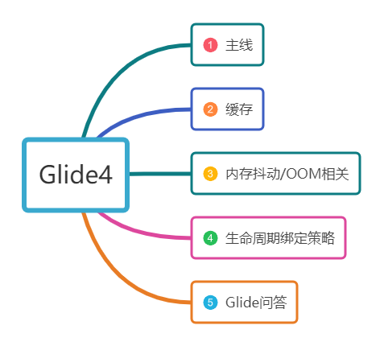
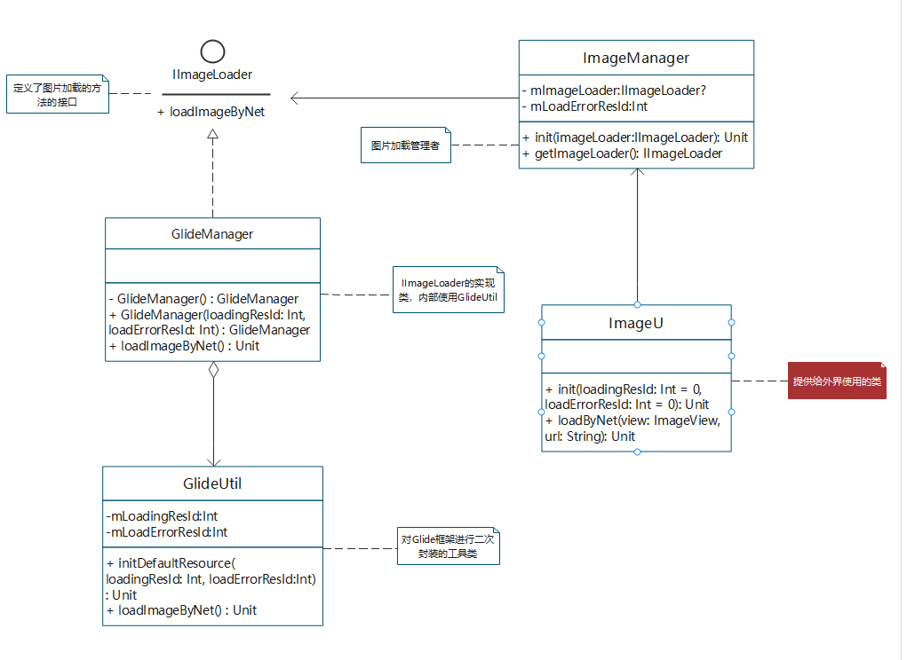
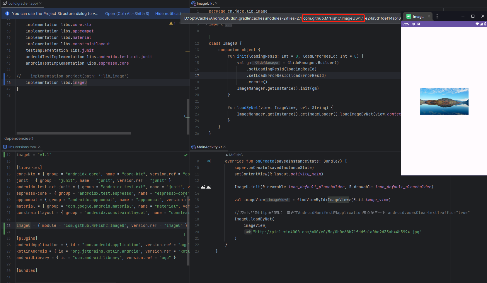

# 一.前言

+ 图片加载框架个人选择的是Glide，该框架非常优秀，其知识体系很庞大，个人就对Glide部分知识的学习做一下总结，同时对框架的使用做一下封装，做成插件。

# 二.知识主干

+ 知识主干如下，每一部分的知识会做一个总结。
  

## 2.1.主线流程

+ Glide的加载主线实际上对应着其三个api方法,with/load/into。
+ with方法涉及到生命周期的绑定，内部需要的资源准备：如，BitmapPool（图片池，支持图片的复用），ArrayPool（数组池，支持Byte[]
的复用），RequestManager（请求管理），RequestManagerRetriever（请求管理检索），MemoryCache（内存缓存）等等的初始化；
+ load方法主要是对外部环境使用Glide框架时设置的配置信息的加载，如：占位图，加载错误，缓存策略等；
+ into方法最为复杂，涉及到的主要有4个方面，对目标资源的加载，加载后进行解码，解码后进行缓存，以及将资源绑定到目标控件；

## 2.2.三级缓存

+ **活动缓存**:优先级最高，存储的是正在使用的资源；
+ **内存缓存**:使用的是Lrucache结合弱引用的方案；
+ **磁盘缓存**:维护了一个Lrucache的队列；
+ 活动缓存存在是为了解决内存缓存使用Lrucache时存在的弊端问题，Lrucache的原理是将最近使用的对象的强引用存储到LinkedHashMap中，并且把最近最少使用的对象在缓存阀值达到之前将其从内存中移除。假设将屏幕中正在使用的图片资源作为内存缓存的方式进行缓存，若出现内存不足的情况，可能会对屏幕中正在使用的资源进行回收，如此会产生不好的用户体验；

## 2.3.内存抖动与OOM

+ **内存抖动**：采用了池的方式进行复用，如BitmapPool对Bitmap进行复用，ArrayPool对Byte[]的复用等；
+ **内存溢出**
    + a.Glide在初始化时设置了内存不足的监听；
    + b.利用生命周期绑定的策略，减少加载到内存的图片大小，必要时才去加载，及时的清理不必要的引用；
    + c.图片采样，对于较为大的图片进行重采样，减少内存的占用；
    + d.使用弱引用，RequestManager内部使用的对象采用了弱引用的方式持有；
    + f.根据实际的业务情况自定义策略，如：对于滑动列表的页面，可以控制滑动速度来决定是否需要加载图片；

## 2.4.生命周期绑定策略

+ 策略一：同Application的生命周期；
+ 策略二：同Activity/Fragment的生命周期；
+ with参数传递的是Activity/Fragment/View时，会创建空白的Fragment绑定到对应的组件上；

## 2.5.Glide问答

+ **子线程使用Glide失效**，其原因是Glide的内部使用了Handler，在RequestManager构造方法中创建Handler时，传递的Looper是主线程的Looper，在子线程中使用Glide最终就相当于在子线程中更新UI，但是没有使用子线程的Looper，导致会抛出异常；
+ **低版本加载Glide变绿的问题**，其原因是早期版本Bitmap的格式是rbg_565,高版本Bitmap的格式是argb_8888,前者代表8位rgb位图，后者代表32位rgb位图，位数越高代表可以存储的颜色信息更多，高版本也就不存在这个变绿的问题；

# 三.插件封装

## 3.1.环境

+ 使用的是Kotlin语言，AGP为8.2.0-alpha07，依赖的Glide版本是4.12.0;

## 3.2.UML类图


## 3.3.核心类
+ IImageLoader：定义图片加载的方法(具体的方法根据实际的业务需求定制)
```
internal interface IImageLoader {
    fun loadImageByNet(context: Context, url: String, imageView: ImageView)
}
```
+ GlideManager:IImageLoader的具体实现类，该类使用了创建型设计模的构建者模式。可以定义多种不同类型的图片加载框架实现类，根据策略模式进行替换；
```
internal class GlideManager private constructor() : IImageLoader {
    constructor(loadingResId: Int, loadErrorResId: Int) : this() {
        //初始化GlideUtil
        GlideUtil.getInstance().initDefaultResource(loadingResId, loadErrorResId)
    }

    override fun loadImageByNet(context: Context, url: String, imageView: ImageView) {
        GlideUtil.getInstance().loadImageByNet(context, url, imageView)
    }

    /**
     * 构建者模式
     */
    class Builder {
        /**
         * 占位图-加载中显示
         */
        private var mLoadingResId = 0

        /**
         * 占位图-加载错误时显示
         */
        private var mLoadErrorResId = 0
        fun setLoadingResId(loadingResId: Int): Builder {
            mLoadingResId = loadingResId
            return this
        }

        fun setLoadErrorResId(loadErrorResId: Int): Builder {
            mLoadErrorResId = loadErrorResId
            return this
        }

        fun create(): GlideManager {
            return GlideManager(mLoadingResId, mLoadErrorResId)
        }
    }

}

```
+ GlideUtil：对Glide框架进行二次封装的类；
```
internal class GlideUtil private constructor() {
    private var mLoadingResId = 0
    private var mLoadErrorResId = 0

    companion object {
        @Volatile
        private var instance: GlideUtil? = null

        fun getInstance(): GlideUtil = instance ?: synchronized(this) {
            instance ?: GlideUtil().also { instance = it }
        }
    }

    fun initDefaultResource(loadingResId: Int, loadErrorResId: Int) {
        mLoadingResId = loadingResId
        mLoadErrorResId = loadErrorResId
    }

    // ====================================== start ======================================
    fun loadImageByNet(context: Context, url: String, imageView: ImageView) {
        var request = Glide.with(context).load(url)
        if(mLoadingResId != 0){
            request.placeholder(mLoadingResId)
        }
        if(mLoadErrorResId != 0){
            request.error(mLoadErrorResId)
        }
        request.into(imageView)
    }
    // ======================================  end  ======================================

}
```

+ ImageManager：图片加载框架的管理者，负责IImageLoader的初始化以及提供获取IImageLoader的方法；

```
internal class ImageManager private constructor() {

    companion object {
        @Volatile
        private var instance: ImageManager? = null

        fun getInstance(): ImageManager = instance ?: synchronized(this) {
            instance ?: ImageManager().also { instance = it }
        }
    }

    private var mImageLoader: IImageLoader? = null

    /**
     * 初始化图片加载框架，建议在application中调用
     * @param imageLoader 指定的图片加载框架
     */
    fun init(imageLoader: IImageLoader) {
        mImageLoader = imageLoader
    }

    fun getImageLoader(): IImageLoader {
        if (mImageLoader == null) {
            throw RuntimeException("ImageU(IImageLoader)'s init function must be call frist!")
        }
        return mImageLoader!!
    }
}
```

+ ImageU：提供给外界使用的类。在使用之前需要做初始化工作；

```
class ImageU {
    companion object {
        fun init(loadingResId: Int = 0, loadErrorResId: Int = 0) {
            val gm = GlideManager.Builder()
                .setLoadingResId(loadingResId)
                .setLoadErrorResId(loadErrorResId)
                .create()
            ImageManager.getInstance().init(gm)
        }

        fun loadByNet(view: ImageView, url: String) {
            ImageManager.getInstance().getImageLoader().loadImageByNet(view.context, url, view)
        }
    }
}
```

## 3.4.上传到jitpack

+ 在Jitpack平台测试的时候没有成功生成依赖，通过错误日志信息，猜测是agp版本的问题，于是对比之前生产过的插件的agp，将agp由8.2.0-alpha07降低至7.3.0，重新操作，未发生报错；
+ 插件如何制作这里就不作介绍了，推荐[Android 安卓创建自己的依赖库（保姆级教程）](https://myhub.blog.csdn.net/article/details/109262602?spm=1001.2101.3001.6650.14&utm_medium=distribute.pc_relevant.none-task-blog-2%7Edefault%7ECTRLIST%7ERate-14-109262602-blog-124888001.pcrelevantt0_20220926_downloadratepraise_v1&depth_1-utm_source=distribute.pc_relevant.none-task-blog-2%7Edefault%7ECTRLIST%7ERate-14-109262602-blog-124888001.pcrelevantt0_20220926_downloadratepraise_v1&utm_relevant_index=15)
+ 添加依赖

```groovy
//setting.gradle中添加:maven { url 'https://jitpack.io' }
dependencyResolutionManagement {
    //...
    repositories {
        //...
        maven { url 'https://jitpack.io' }
    }
}
//build.gradle中添加
implementation 'com.github.MrFishC:ImageU:v1.1'
```

+ 测试效果如下
  

# 四.总结

+ 本文针对仅对Glide的部分知识做了一下总结，运用了单例，构建者设计模式对Glide图片加载框架的封装并生成插件（后续会逐步的完善）。
+ <font color="#dd0000">该插件的优点:</font><font color="#0000dd">
  对于使用者而言不需要关注底层具体使用的是哪一种加载框架，若需要替换加载框架，只需要替换GlideManager和GlideUtil即可。</font>
  该插件的封装方式虽然使用的是Kotlin语言，但同样适用与Java语言。
+ 若使用Kotlin，我们可以使用DSL的方式（项目中有示例）或者拓展函数的方式来封装Glide。

# License

```
/*
* Copyright (C)  MrFishC, ImageU Open Source Project
*
* Licensed under the Apache License, Version 2.0 (the "License");
* you may not use this file except in compliance with the License.
* You may obtain a copy of the License at
*
*      http://www.apache.org/licenses/LICENSE-2.0
*
* Unless required by applicable law or agreed to in writing, software
* distributed under the License is distributed on an "AS IS" BASIS,
* WITHOUT WARRANTIES OR CONDITIONS OF ANY KIND, either express or implied.
* See the License for the specific language governing permissions and
* limitations under the License.
  */
```
